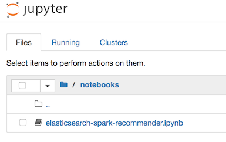
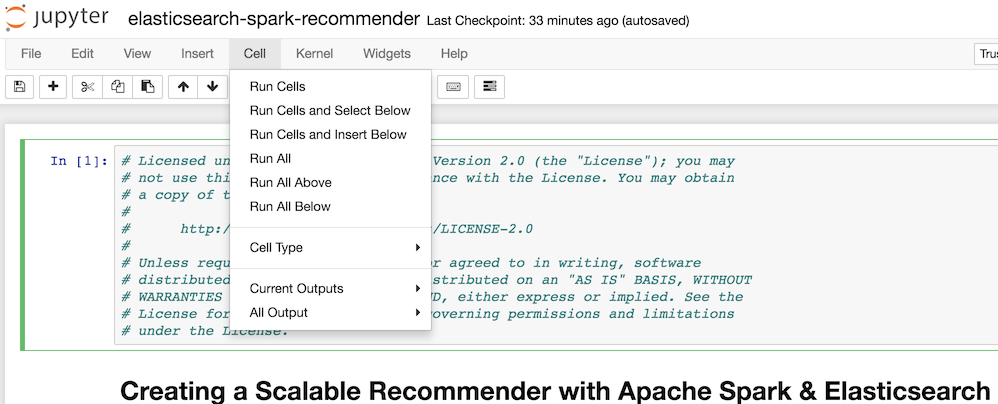

<!--[](https://travis-ci.org/IBM/REPO)-->
<!---->

# Building a Recommender with Apache Spark & Elasticsearch
In this developer journey, we will create a scalable recommender system using Apache Spark and Elasticsearch.

[TBC - Explain briefly how things work].

This repo contains a Jupyter notebook illustrating the basics of how to use Spark for training a collaborative filtering recommendation models from ratings data stored in Elasticsearch, saving the model factors to Elasticsearch, and then using Elasticsearch to serve real-time recommendations using the user and item factors.

When the reader has completed this journey, they will understand how to:

* Ingest and index user event data into Elasticsearch using the Elasticsearch Spark connector
* Load event data into Spark DataFrames and use Spark's machine learning library (MLlib) to train a
collaborative filtering recommender model
* Export the trained model into Elasticsearch
* Using a custom Elasticsearch plugin, compute user and _similar item_ recommendations and combine
recommendations with search and content filtering


## Flow
<!--Add new flow steps based on the architecture diagram-->
1. Load the movie dataset into Spark.
2. Use Spark DataFrame operations to clean up the dataset and load it into Elasticsearch.
3. Using Spark MLlib, train a collaborative filtering recommendation model.
4. Save the resulting model into Elasticsearch.
5. Using Elasticsearch queries and a custom vector scoring plugin, generate some example recommendations. [The Movie Database](https://www.themoviedb.org/) API is used to display movie poster images for the recommended movies.

## Included components
* [Apache Spark](http://spark.apache.org/): An open-source, fast and general-purpose cluster computing system
* [Elasticsearch](http://elasticsearch.org): Open-source search and analytics engine 
* [Jupyter Notebooks](http://jupyter.org/): An open-source web application that allows you to
create and share documents that contain live code, equations, visualizations and explanatory text.

## Featured technologies
* [Data Science](https://medium.com/ibm-data-science-experience/): Systems and scientific methods to analyze
structured and unstructured data in order to extract knowledge and insights.
* [Artificial Intelligence](https://medium.com/ibm-data-science-experience): Artificial intelligence can be
applied to disparate solution spaces to deliver disruptive technologies.
* [Python](https://www.python.org/): Python is a programming language that lets you work more quickly
and integrate your systems more effectively.

<!--Update this section when the video is created-->
# Watch the Video
[](https://www.youtube.com/watch?v=VIDEO)

# Steps
Follow these steps to create the required services and run the notebook locally.

1. [Clone the repo](#1-clone-the-repo)
2. [Set up Elasticsearch](#2-set-up-elasticsearch)
3. [Download the Elasticsearch Spark connector](#3-download-the-elasticsearch-spark-connector)
4. [Download Apache Spark](#4-download-apache-spark)
5. [Download the data](#5-download-the-data)
6. [Launch the notebook](#6-launch-the-notebook)
7. [Run the notebook](#7-run-the-notebook)

### 1. Clone the repo

Clone the `REPO` locally. In a terminal, run:

```
$ git clone https://github.com/IBM/REPO
```

### 2. Set up Elasticsearch

This Journey currently depends on Elasticsearch 5.3.0. Go to the [downloads page](https://www.elastic.co/downloads/past-releases/elasticsearch-5-3-0) and download the appropriate package for your system.

For example on Linux / Mac you can download the [TAR archive](https://artifacts.elastic.co/downloads/elasticsearch/elasticsearch-5.3.0.tar.gz) and unzip it using the command:

```
$ tar xfvz elasticsearch-5.3.0.tar.gz
```

Change directory to the newly unzipped folder using:

```
$ cd elasticsearch-5.3.0
```

Next, you will need to install the [Elasticsearch vector scoring plugin](https://github.com/MLnick/elasticsearch-vector-scoring). You can do this by running the following command (Elasticsearch will download the plugin file for you):

```
$ ./bin/elasticsearch-plugin install https://github.com/MLnick/elasticsearch-vector-scoring/releases/download/v5.3.0/elasticsearch-vector-scoring-5.3.0.zip
```

Next, start Elasticsearch (do this in a separate terminal window in order to keep it up and running):

```
$ ./bin/elasticsearch
```

You should see some start up logs displayed. Check that the `elasticsearch-vector-scoring-plugin` is successfully loaded:

```
$ ./bin/elasticsearch
[2017-09-08T15:58:18,781][INFO ][o.e.n.Node               ] [] initializing ...
...
[2017-09-08T15:58:19,406][INFO ][o.e.p.PluginsService     ] [2Zs8kW3] loaded plugin [elasticsearch-vector-scoring]
[2017-09-08T15:58:20,676][INFO ][o.e.n.Node               ] initialized
...
```

Finally, you will need to install the Elasticsearch Python client. You can do this by running the following command (you should do this in a separate terminal window to the one running Elasticsearch):

```
$ pip install elasticsearch
```

### 3. Download the Elasticsearch Spark connector

You will need to run your PySpark notebook with the `elasticsearch-spark` JAR (version `5.3.0`) on the classpath. Follow these steps to set up the connector:

1. [Download the ZIP file](http://download.elastic.co/hadoop/elasticsearch-hadoop-5.3.0.zip).
2. Unzip the file by running `$ unzip elasticsearch-hadoop-5.3.0.zip`.
3. The connector JAR will be located in the `dist` subfolder.

### 4. Download Apache Spark

This Journey should work with any Spark 2.x version, however it is recommended that you download the latest version of Spark (currently 2.2.0) from the [downloads page](http://spark.apache.org/downloads.html). Once you have downloaded the file, unzip it by running `$ tar xfz spark-2.2.0-bin-hadoop2.7.tgz`.

> *Note if you download a different version, adjust the relevant command used above and elsewhere in this Journey accordingly*


### 5. Download the data

You will be using the [Movielens dataset](https://grouplens.org/datasets/movielens/) of ratings given by a set of users to movies, together with movie metadata. There are a few versions of the dataset. You should download the ["latest small" version](http://files.grouplens.org/datasets/movielens/ml-latest-small.zip). Once downloaded, unzip the file by running `$ unzip ml-latest-small.zip`.

### 6. Launch the notebook

To run the notebook you will need to launch a PySpark session within a Jupyter notebook. Remember to include the Elasticsearch Spark connector JAR from [step 3](#3-download-the-elasticsearch-spark-connector) on the classpath.

From the base directory of the Journey repository that you cloned in [step 1](#1-clone-the-repo), run the following command to launch your PySpark notebook server locally (here `PATH_TO_SPARK` is the path where you unzipped the Spark release, and `PATH_TO_ES_SPARK` is the path where you unzipped the Elasticsearch Spark connector (this assumes you are running Spark with the default Scala version of `2.11`):
```
PYSPARK_DRIVER_PYTHON="jupyter" PYSPARK_DRIVER_PYTHON_OPTS="notebook" PATH_TO_SPARK/bin/pyspark --driver-memory 4g --driver-class-path PATH_TO_ES_SPARK/dist/elasticsearch-spark_2.11-5.3.0.jar
```

This should open a browser window with the Journey folder contents displayed. Click on the `notebooks` subfolder and then click on the `elasticsearch-spark-recommender.ipynb` file to launch the notebook.



### 7. Run the notebook

> _Optional:_
>
> In order to display the images in the recommendation demo, you will need to access [The Movie Database API](https://www.themoviedb.org/documentation/api). Please follow the [instructions](https://developers.themoviedb.org/3/getting-started) to get an API key. You will also need to install the Python client using the command `$ pip install tmdbsimple`.
>
> The demo will still work without this API access, but no images will be displayed (so it won't look as good!).

When a notebook is executed, what is actually happening is that each code cell in
the notebook is executed, in order, from top to bottom.

Each code cell is selectable and is preceded by a tag in the left margin. The tag
format is `In [x]:`. Depending on the state of the notebook, the `x` can be:

* A blank, this indicates that the cell has never been executed.
* A number, this number represents the relative order this code step was executed.
* A `*`, this indicates that the cell is currently executing.

There are several ways to execute the code cells in your notebook:

* One cell at a time.
  * Select the cell, and then press the `Play` button in the toolbar. You can also hit `Shift+Enter` to execute the cell
  and move to the next cell.
* Batch mode, in sequential order.
  * From the `Cell` menu bar, there are several options available. For example, you
    can `Run All` cells in your notebook, or you can `Run All Below`, that will
    start executing from the first cell under the currently selected cell, and then
    continue executing all cells that follow.



# Sample output

The example output in the `data/examples` folder shows the output of the notebook after running it in full. View it it [here]().

> *Note:* To see the code and markdown cells without output, you can view [the raw notebook in the Github viewer](notebooks/elasticsearch-spark-recommender.ipynb).

# Links

* [Demo on Youtube](https://www.youtube.com/watch?v=VIDEO)
* Watch the [meetup presentation](https://youtu.be/sa_Y488vj0M) and [slide deck](https://www.slideshare.net/sparktc/spark-ml-meedup-pentreath-puget) covering some of the background and technical details behind this Journey.
* An extended version of the above presentation was given at ApacheCon Big Data Europe 2016 (see [slides](http://events.linuxfoundation.org/sites/events/files/slides/ApacheBigDataEU16-NPentreath.pdf)).

# Troubleshooting

* Error: XYZ

  > Solution

* Error: ABC

  > Solution

<!--keep this-->

# License
[Apache 2.0](LICENSE)
