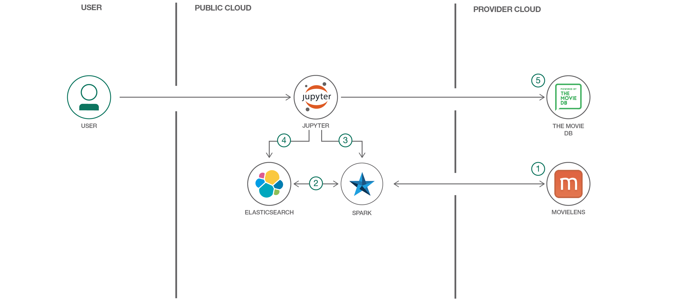

[](https://travis-ci.org/IBM/REPO)
<!---->

# Building a Recommender with Apache Spark & Elasticsearch
In this developer journey, we will create a scalable recommender system using Apache Spark and Elasticsearch.

[Explain briefly how things work].

When the reader has completed this journey, they will understand how to:

* Ingest and index user event data into Elasticsearch
* Load event data into Spark DataFrames and use Spark's machine learning library (MLlib) to train a
collaborative filtering recommender model
* Export the trained model into Elasticsearch
* Using a custom Elasticsearch plugin, compute user and _similar item_ recommendations and combine
recommendations with search and content filtering



## Flow
<!--Add new flow steps based on the architecture diagram-->
1. Step 1.
2. Step 2.
3. Step 3.
4. Step 4.
5. Step 5.

## Included components
* [Apache Spark](http://spark.apache.org/): An open-source, fast and general-purpose cluster computing system
* [Elasticsearch](http://elasticsearch.org): Open-source search and analytics engine 
* [Jupyter Notebooks](http://jupyter.org/): An open-source web application that allows you to
create and share documents that contain live code, equations, visualizations and explanatory text.

## Featured technologies
* [Data Science](https://medium.com/ibm-data-science-experience/): Systems and scientific methods to analyze
structured and unstructured data in order to extract knowledge and insights.
* [Artificial Intelligence](https://medium.com/ibm-data-science-experience): Artificial intelligence can be
applied to disparate solution spaces to deliver disruptive technologies.
* [Python](https://www.python.org/): Python is a programming language that lets you work more quickly
and integrate your systems more effectively.

<!--Update this section when the video is created-->
# Watch the Video
[](https://www.youtube.com/watch?v=VIDEO)

# Steps
Use the ``Deploy to Bluemix`` button **OR** create the services and run locally.

## Deploy to Bluemix
<!--Update the repo and tracking id-->
[](https://bluemix.net/deploy?repository=https://github.com/IBM/REPO.git)

1. Press the above ``Deploy to Bluemix`` button and then click on ``Deploy``.

<!--optional step-->
2. In Toolchains, click on Delivery Pipeline to watch while the app is deployed. Once deployed, the app can be viewed by clicking 'View app'.


<!--update with service names from manifest.yml-->
3. To see the app and services created and configured for this journey, use the Bluemix dashboard. The app is named `APP` with a unique suffix. The following services are created and easily identified by the `APP-` prefix:
    * TODO

## Run locally
> NOTE: These steps are only needed when running locally instead of using the ``Deploy to Bluemix`` button.

<!-- there are MANY updates necessary here, just screenshots where appropriate -->

1. [Clone the repo](#1-clone-the-repo)
2. [Download and run Elasticsearch](#2-create-watson-services-with-ibm-bluemix)
3. [Download the elasticsearch-hadoop JAR](#3-import-the-conversation-workspace)
4. [Download Apache Spark](#4-load-the-discovery-documents)
5. [Run the Notebook](#5-run-the-notebook)

### 1. Clone the repo

Clone the `REPO` locally. In a terminal, run:

```
$ git clone https://github.com/IBM/REPO
```

We’ll be using the file [`data/conversation/workspaces/banking.json`](data/conversation/workspaces/banking.json) and the folder
[`data/conversation/workspaces/`](data/conversation/workspaces/)

### 2. Create Watson services with IBM Bluemix

Create the following services:

* [**Watson Conversation**](https://console.ng.bluemix.net/catalog/services/conversation)
* [**Watson Discovery**](https://console.ng.bluemix.net/catalog/services/discovery)
* [**Watson Tone Analyzer**](https://console.ng.bluemix.net/catalog/services/tone-analyzer)
* [**Watson Natural Language Understanding**](https://console.ng.bluemix.net/catalog/services/natural-language-understanding)

### 3. Import the Conversation workspace

Launch the **Watson Conversation** tool. Use the **import** icon button on the right

Find the local version of [`data/conversation/workspaces/banking.json`](data/conversation/workspaces/banking.json) and select
**Import**. Find the **Workspace ID** by clicking on the context menu of the new
workspace and select **View details**. Save this ID for later.

*Optionally*, to view the conversation dialog select the workspace and choose the
**Dialog** tab, here's a snippet of the dialog:


### 4. Load the Discovery documents

Launch the **Watson Discovery** tool. Create a **new data collection**
and give the data collection a unique name.

> Save the **environment_id** and **collection_id** for your `.env` file in the next step.

Under `Add data to this collection` use `Drag and drop your documents here or browse from computer` to seed the content with the five documents in `data/discovery/docs`.

### 5. Configure credentials

The credentials for Bluemix services (Conversation, Discovery, Tone Analyzer and
Natural Language Understanding), can be found in the ``Services`` menu in Bluemix,
by selecting the ``Service Credentials`` option for each service.

The other settings for Conversation and Discovery were collected during the
earlier setup steps (``DISCOVERY_COLLECTION_ID``, ``DISCOVERY_ENVIRONMENT_ID`` and
``WORKSPACE_ID``).

Copy the [`env.sample`](env.sample) to `.env`.

```
$ cp env.sample .env
```
Edit the `.env` file with the necessary settings.

#### `env.sample:`

```
# Replace the credentials here with your own.
# Rename this file to .env before starting the app.

# Watson conversation
CONVERSATION_USERNAME=<add_conversation_username>
CONVERSATION_PASSWORD=<add_conversation_password>
WORKSPACE_ID=<add_conversation_workspace>

# Watson Discovery
DISCOVERY_USERNAME=<add_discovery_username>
DISCOVERY_PASSWORD=<add_discovery_password>
DISCOVERY_ENVIRONMENT_ID=<add_discovery_environment>
DISCOVERY_COLLECTION_ID=<add_discovery_collection>

# Watson Natural Language Understanding
NATURAL_LANGUAGE_UNDERSTANDING_USERNAME=<add_nlu_username>
NATURAL_LANGUAGE_UNDERSTANDING_PASSWORD=<add_nlu_password>

# Watson Tone Analyzer
TONE_ANALYZER_USERNAME=<add_tone_analyzer_username>
TONE_ANALYZER_PASSWORD=<add_tone_analyzer_password>

# Run locally on a non-default port (default is 3000)
# PORT=3000

```

### 6. Run the application
1. ...
2. ...
3. ...
> Note: TODO

# Sample output


# Links
* [Demo on Youtube](https://www.youtube.com/watch?v=VIDEO)

# Troubleshooting

* Error: XYZ

  > Solution

* Error: ABC

  > Solution

<!--keep this-->

# License
[Apache 2.0](LICENSE)

<!--This can stay as-is if using Deploy to Bluemix-->

# Privacy Notice
If using the `Deploy to Bluemix` button some metrics are tracked, the following
information is sent to a [Deployment Tracker](https://github.com/IBM-Bluemix/cf-deployment-tracker-service) service
on each deployment:

* Node.js package version
* Node.js repository URL
* Application Name (`application_name`)
* Application GUID (`application_id`)
* Application instance index number (`instance_index`)
* Space ID (`space_id`)
* Application Version (`application_version`)
* Application URIs (`application_uris`)
* Labels of bound services
* Number of instances for each bound service and associated plan information

This data is collected from the `package.json` file in the sample application and the `VCAP_APPLICATION` and `VCAP_SERVICES` environment variables in IBM Bluemix and other Cloud Foundry platforms. This data is used by IBM to track metrics around deployments of sample applications to IBM Bluemix to measure the usefulness of our examples, so that we can continuously improve the content we offer to you. Only deployments of sample applications that include code to ping the Deployment Tracker service will be tracked.

## Disabling Deployment Tracking

To disable tracking, simply remove ``require("cf-deployment-tracker-client").track();`` from the ``app.js`` file in the top level directory.
